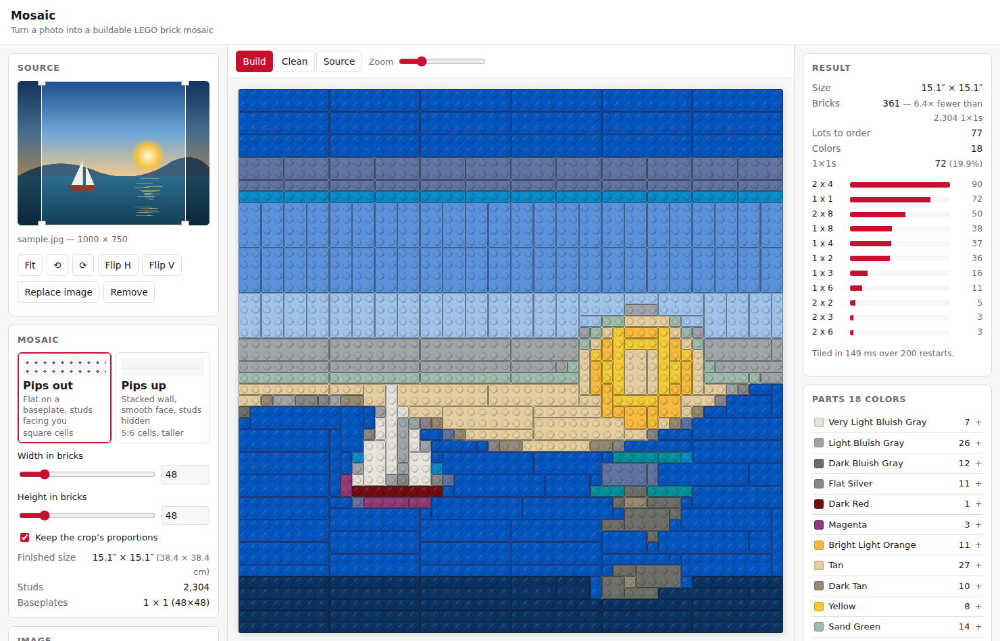
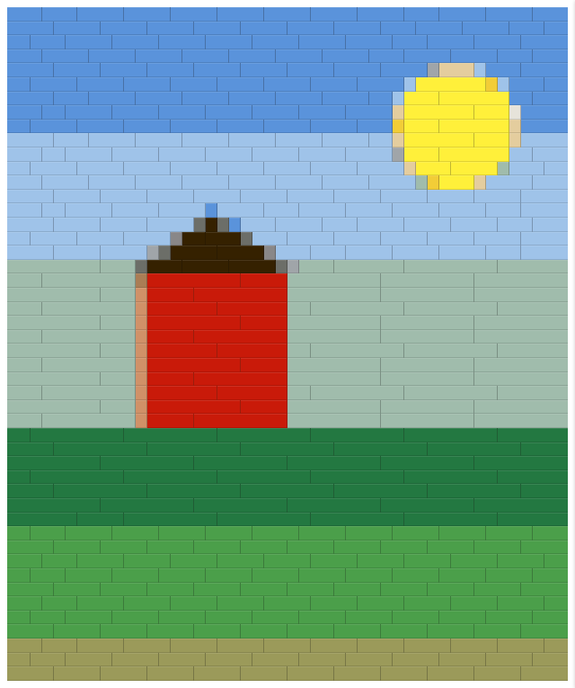
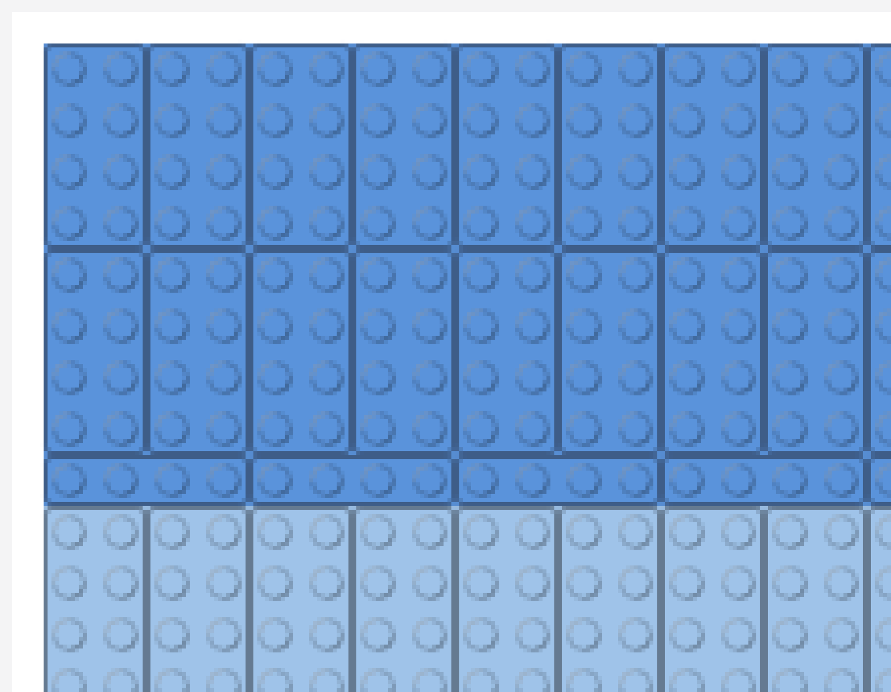

# Mosaic

A single-page web app that turns a photo into a buildable LEGO brick mosaic — with a real
parts list you can order and a rendered preview of the finished build.

Everything runs in the browser. There is no server and no account; a project is saved and
restored as a single JSON file.

## What it does

- Upload a PNG or JPEG and frame it with a draggable, freely resizable crop box. The
  mosaic takes the crop's shape — square, panoramic, portrait, whatever you frame.
- Choose **pips out** (studs facing you, square cells, laid flat on a baseplate) or
  **pips up** (studs facing the ceiling, viewed edge-on as a stacked wall, 5:6 cells).
- Set the mosaic size in bricks; see the finished size in inches.
- The image is downsampled, mapped to real LEGO colors, and — importantly — merged into
  the **largest legal bricks available**, so a flat region becomes a handful of 2×8s
  rather than hundreds of 1×1s. Cheaper, faster to build, stronger.
- Export the preview PNG, a parts-list CSV, a BrickLink Wanted List XML, and a
  Pick a Brick CSV that imports straight into lego.com.

## Status



**Complete.** Drop in a photo — or press **Try a sample photo** — frame it, choose an
orientation and size, and get a rendered brick preview, a parts list and downloadable
exports, with the heavy work in a Web Worker and projects that save and reopen.

Three things are prepared rather than finished, and are marked as such in
[TODO.md](./TODO.md): Firefox and Safari are untested (only Chromium was available
here); the GitHub Pages workflow is committed but publishing needs Pages switched on
for the repository; and the Pick a Brick export ships with no element IDs loaded — see
[below](#the-pick-a-brick-export), where not inventing them is the point.

```bash
npm install && npm run dev
```

### Performance

Measured on the reference machine, strict availability on, 200 restarts:

| Grid | Orientation | Frame | Quantize + tile | Pieces | vs all-1×1 |
| ---- | ----------- | ----- | --------------- | ------ | ---------- |
| 64²  | pips-out    | 28 ms | 310 ms          | 524    | 7.8×       |
| 64²  | pips-up     | 33 ms | 10 ms           | 904    | 4.5×       |
| 128² | pips-out    | 43 ms | 984 ms          | 1,956  | 8.4×       |
| 128² | pips-up     | 26 ms | 19 ms           | 3,380  | 4.8×       |
| 256² | pips-out    | 36 ms | 1,523 ms        | 7,474  | 8.8×       |
| 256² | pips-up     | 32 ms | 22 ms           | 13,059 | 5.0×       |

Framing is flat regardless of grid size — it is bounded by the source image. The wall
tiler finishes in milliseconds because its DP is exact and runs once; the flat tiler
spends its budget on randomized restarts, and at 256² the 1.5 s budget cuts it to 75 of
the 200 requested. All of it runs in a worker, so the interface stays responsive: a
click during a 160×160 tile completes in ~150 ms.

### Projects

A project is one JSON file. It always stores the quantized grid — run-length encoded, so
a 256² mosaic is 353 runs and 2.7 KB — and optionally embeds the source photo. With the
photo it reopens fully editable (~47 KB for a 900×700 JPEG); without it (~10 KB) the
mosaic still renders, re-tiles and exports, but the crop and colors are fixed.

The tiling itself is never stored: it is recomputed from the grid, the settings and the
seed, so a saved file cannot disagree with itself.

- [DESIGN.md](./DESIGN.md) — full design: geometry, algorithms, data model, UI, formats
- [TODO.md](./TODO.md) — phased implementation plan

### The two orientations

These are not two aspect ratios — they are two different physical builds, and they need
two different tiling algorithms.

|                | Pips out                              | Pips up                                |
| -------------- | ------------------------------------- | -------------------------------------- |
| What you see   | studs facing you                      | smooth brick sides, studs hidden       |
| Construction   | laid flat on a baseplate              | stacked wall, one course per row       |
| Cell           | 8.0 × 8.0 mm — square                 | 8.0 × 9.6 mm — 5:6, taller than wide   |
| Bricks         | any rectangle, either rotation        | 1×N only; nothing spans two courses    |
| Seams          | cosmetic — the baseplate carries load | structural — a stacked seam is a crack |
| 48×48 finishes | 15.1″ × 15.1″                         | 15.1″ × 18.1″                          |

Two consequences fall out of that table and are easy to get wrong. Sampling has to be
**anisotropic** in pips-up — each cell covers a source region 1.2× taller than it is
wide, so a square sampling grid squashes the picture. And the wall tiler staggers its
seams into a running bond, because a seam repeating up the courses is a fracture line in
a wall one stud deep.

### Framing

The crop and the finished mosaic must share proportions, or the picture comes out
stretched. That is a hard rule — but which side gives way is a choice, and **Shape the
mosaic to the crop** (on by default) makes it: with it on, the crop leads, so drag it to
any shape and the brick counts follow; with it off, the counts lead and the crop is
reshaped to match. Nothing forces a square. A photo opens framed edge to edge, and the
mosaic starts out the shape of the photo.



Close up, in pips-out, you can see the merging the tiler does — large flat regions
become 2×4s and 2×8s rather than hundreds of 1×1s:



## Getting started

```bash
npm install
npm run dev        # dev server
npm test           # algorithm test suite
npm run build      # static production bundle into dist/
npm run check      # typecheck + lint + format check + tests
```

| Script                | What it does                                         |
| --------------------- | ---------------------------------------------------- |
| `dev`                 | Vite dev server with HMR                             |
| `build`               | typecheck, then build the static bundle into `dist/` |
| `preview`             | serve the built bundle locally                       |
| `test` / `test:watch` | Vitest, once / in watch mode                         |
| `coverage`            | Vitest coverage over `src/lego/`                     |
| `typecheck`           | `tsc --noEmit`                                       |
| `lint` / `lint:fix`   | ESLint                                               |
| `format`              | Prettier, write in place                             |
| `check`               | everything above, for CI or a pre-push gate          |

Requires Node 20+ (developed on 22).

### Browser support

Developed and verified in Chromium. The app uses `createImageBitmap`, `OffscreenCanvas`,
module Web Workers and `CanvasRenderingContext2D.roundRect`; each has a fallback —
an `` decode path, a plain `<canvas>`, a synchronous in-thread pipeline, and square
brick corners respectively — so an older engine degrades rather than breaking.

**Firefox and Safari are untested.** Only Chromium was available in the environment this
was built in, so those fallbacks are written against documented behaviour, not observed
behaviour. Worth an hour on real browsers before calling it done.

### Layout

`src/lego/` holds the domain logic: geometry, color math, framing, quantization, the two
tilers, the parts list, and the exports. It is pure TypeScript with no React and no DOM
access, so it is unit-testable in Node and reusable from a CLI later.

`src/browser/` holds the platform adapters — decoding a `File` into pixels, handing a
Blob to the user's disk. These are the only modules that touch the DOM outside the UI
itself; everything else that does belongs in `src/components/`.

## The Pick a Brick export

lego.com's Pick a Brick imports a two-column CSV:

```csv
elementId,quantity
300321,18
300121,999
```

**Element IDs, not design IDs.** A design ID names a _shape_: 3001 is the 2×4 brick in
every color there is. An element ID names one specific _(shape, color)_ pair, which is
what an order actually consists of. Pick a Brick keys on elements, and unlike the
BrickLink XML there is no name column in the file for a human to sanity-check against.

The two are not derivable from each other. Plenty of classic elements do read as the
design ID with a LEGO color number stuck on the end — 3001 in Bright Red is 300121, 3003
is 300321 — but modern parts get seven-digit sequential IDs that follow no pattern, so
that convention is a coincidence to recognise, never a rule to apply. It is a lookup
table.

**So the shipped palette contains no element IDs at all**, and none were invented. The
export machinery is complete and tested; the data slot is empty. Until you load a real
table the button is disabled, the panel says so, and the file it would write is a bare
header. Lots with no known element ID are dropped from the file and named in a warning
rather than guessed at — the same posture as the BrickLink color IDs.

To load a real table (Rebrickable's `elements.csv`, a BrickLink export, a hand-kept
sheet):

```bash
npm run palette:elements -- elements.csv
```

Columns are matched loosely and case-insensitively: `element_id`, `part_num` (or
`design_id`), and `color` — resolved against the palette key, the color name, or the
BrickLink color ID, in that order. Rows naming a design or color the palette does not
carry are reported and skipped, and nothing is written if the merged result would fail
validation. The panel then reports coverage as _n of 334 brick-and-color pairs_.

Quantities above 999 are split across repeated rows rather than clamped, since Pick a
Brick caps a single order line and silently dropping bricks from an order that looked
complete would be worse than a longer file.

## A note on the color data

**The shipped palette is unverified.** `src/lego/palette.data.json` holds 42 curated
colors compiled from reference knowledge, without access to a live catalog. Hex values
are reasonable, BrickLink color IDs are plausible but unconfirmed, and the per-shape
availability lists are a coarse four-tier estimate rather than real catalog data.

The code is built around that uncertainty rather than hiding it: the file carries a
`provenance.verified: false` flag that `loadPalette` surfaces as a warning, colors with
no BrickLink ID are omitted from the Wanted List export instead of being guessed, and
the tests validate structure only — never specific hex values — so correcting the data
never looks like a regression.

To replace it with real data:

```bash
npm run palette:build -- colors.csv --verified
```

The input may be CSV or JSON, local or a URL. Required columns are `name` and one of
`hex` / `rgb` (accepting `#RRGGBB`, `RRGGBB`, or `r,g,b`). Optional: `key`, `bl_id`,
`shapes` (space-separated design IDs), and `tier` (`full` / `broad` / `common` /
`limited`, expanded into per-shape availability). The script validates before writing
and refuses to emit a file with structural errors.
